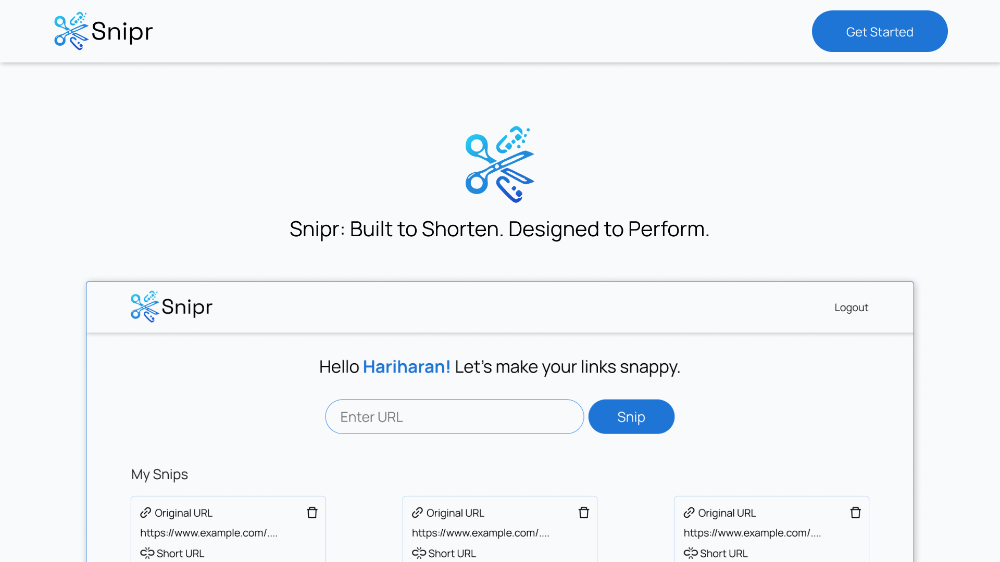

# Snipr Client

Snipr is a modern, user-friendly URL shortener web application. This is the frontend client, built with React, Vite, and Tailwind CSS. It allows users to create, manage, and track short links with a clean and responsive interface.

## Features

- **User Authentication**: Sign up and sign in with secure token-based authentication.
- **Dashboard**: Personalized dashboard to create, view, and manage your short links ("Snips").
- **URL Shortening**: Instantly shorten long URLs with a single click.
- **Link Management**: View all your snipped URLs, copy short links, and delete them as needed.
- **Click Tracking**: See the number of clicks for each short link.
- **Responsive Design**: Works seamlessly on desktop and mobile devices.
- **Notifications**: User feedback via toast notifications for actions and errors.

## Tech Stack

- [React](https://react.dev/) (with React Router)
- [Vite](https://vitejs.dev/)
- [Tailwind CSS](https://tailwindcss.com/)
- [Axios](https://axios-http.com/) (API requests)
- [React Toastify](https://fkhadra.github.io/react-toastify/) (notifications)
- ESLint (code quality)

## Getting Started

### Prerequisites

- Node.js (v18 or higher recommended)
- npm or yarn

### Installation

1. **Clone the repository:**
	```sh
	git clone https://github.com/hariharan-dev-05/snipr-client.git
	cd snipr-client
	```
2. **Install dependencies:**
	```sh
	npm install
	# or
	yarn install
	```
3. **Configure API Endpoint:**
	- By default, the frontend expects the backend API at `http://localhost:3000/` (see `src/api/axiosInstance.js`).
	- Update the `baseURL` in `axiosInstance.js` if your backend runs elsewhere.

### Running the App

Start the development server:

```sh
npm run dev
# or
yarn dev
```

The app will be available at [http://localhost:5173](http://localhost:5173) (or as shown in your terminal).

### Building for Production

```sh
npm run build
# or
yarn build
```

### Linting

```sh
npm run lint
# or
yarn lint
```

## Project Structure

- `src/` — Main source code
  - `api/` — API request logic (Axios instance, API functions)
  - `assets/` — Images and SVGs
  - `components/` — Reusable UI components (Navbar, Card, Signin, Signup)
  - `context/` — React context for authentication
  - `layouts/` — Layout components (e.g., AuthLayout)
  - `pages/` — Main pages (Home, Snipr dashboard)
  - `index.css` — Tailwind and custom styles
- `public/` — Static assets (favicon, images)
- `vite.config.js` — Vite configuration
- `eslint.config.js` — ESLint configuration

## Usage

1. **Sign up** for a new account or sign in with existing credentials.
2. **Create a Snip** by entering a long URL and clicking "Snip".
3. **Manage your links**: Copy, view click stats, or delete your snips from the dashboard.
4. **Logout** securely from the dashboard.

## Screenshots



---

_Snipr: Built to Shorten. Designed to Perform._
